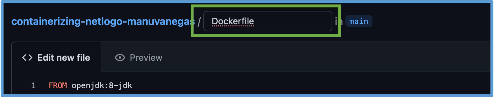
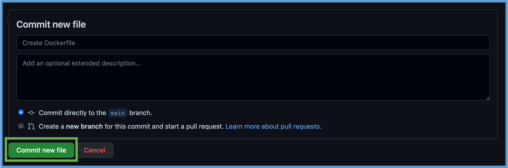
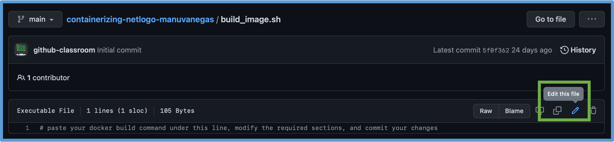

# Containerizing a NetLogo model

Welcome! This tutorial will walk you through the process of containerizing a NetLogo model. To learn more about the importance of containerizing models and the basic principles behind this tool, we invite you to read [our article](https://doi.org/10.18174/sesmo.18074). The objective of this tutorial is to provide you with a hands-on experience of the steps involved, without the need to download or run anything locally on your machine. Once completed, we expect you to have a basic understanding of what you need to do to containerize and run your NetLogo model using Docker. With this knowledge and following the instructions given in [`docs/Next Steps`](docs/Next%20Steps), you should be able to containerize your own model on your local machine. Please note that we assume that you have completed the [Basics of Git and GitHub tutorial](https://classroom.github.com/a/bLyjPEf6) beforehand or that you are already familiar with how to use GitHub.

We have structured this repository following the [suggested project organization](https://swcarpentry.github.io/good-enough-practices-in-scientific-computing/#project-organization) by Software Carpentry. Feel free to implement this organization within your own project. In this tutorial you will containerize the "Wolf Sheep Predation" model from NetLogo's model library. We have modified it to create a mock BehaviorSpace experiment (named "experiment1") and included it in the `src` folder of this repository. Feel free to explore the contents of this repository before coming back to this page. However, we suggest that you refrain from modifying them until instructed in the steps below. 

***

### A note on the tutorial workflow

We break down the process of building and running a Docker container into three steps. You will be able to complete these steps using GitHub's browser interface, but you can also choose to clone this repository to your local machine and push your changes from there. Keep in mind that the repository will only allow you to create a `Dockerfile` and modify the existing `build_image.sh` and `run_experiment.sh` files (yes, just three steps to containerize a model!).

We recommend using GitHub's browser interface and opening this repository in a second tab; this way you will be able to revisit the instructions while you create or edit files. Every time you commit (or push, if working from your local machine) your changes, the repository will automatically check your progress on each of the three steps. For now, the steps are marked as incomplete. By making the changes indicated in the instructions below, you will be able to sequentially pass each of the three steps. You can make as many attempts as needed to successfully complete them. To check your progress, right-click on the badge shown at the end of each step, open the link in a new tab, and then click on the name of your latest commit. Here is an example of one of the badges:

[](../../actions/workflows/complete.yml)

At this point, the badge is in a gray, `no status`, state. It will stay this way until all three steps of the tutorial are successfully completed, at which point it will change to a green, `passing` state. However, keep in mind that, even when your submission has passed the step's tests, it takes some minutes for the corresponding badge status to update to `passing`. Therefore, it is advisable to click on the badge and look for the results of the latest commit, instead of waiting until the badge status is updated. The appropriate badge will appear at the end of each step to make it easier to check your progress.

***

Once you successfully containerize this model and run the mock experiment, you will have completed this tutorial. We expect that this exercise will equip you with the basic tools needed to containerize any NetLogo model. After completing this tutorial, we invite you to follow the instructions given in [`docs/Next Steps`](docs/Next%20Steps) to download this repository and modify the steps described here to containerize your own model. We have included a list of common Docker error messages and how to solve them at [`docs/extras/Troubleshooting.md`](docs/extras/Troubleshooting.md). Let us know if you find any roadblocks or any other problem by creating an issue [here](https://github.com/comses-education/NetLogo-headless-tutorial/issues)!


## Step 1: Creating a Dockerfile

The Dockerfile is the file that describes how to create the image of your model and what steps to execute when you run a container based on that image. Follow these instructions (preferably in a separate tab, which will allow you to revisit the instructions while working on your file) to create the Dockerfile for this model:

1. Copy the following code (see [`docs/extras/Dockerfile Sections.md`](docs/extras/Dockerfile%20Sections.md) for more details about the commands used in this Dockerfile):

```Dockerfile
FROM openjdk:8-jdk

ARG MODEL_PATH
ARG NETLOGO_VERSION
ARG NETLOGO_NAME=NetLogo-$NETLOGO_VERSION
ARG NETLOGO_URL=https://ccl.northwestern.edu/netlogo/$NETLOGO_VERSION/$NETLOGO_NAME-64.tgz

ENV LC_ALL=C.UTF-8 \
    LANG=C.UTF-8
    
RUN mkdir /home/netlogo \
 && wget $NETLOGO_URL \
 && tar xzf $NETLOGO_NAME-64.tgz -C /home/netlogo --strip-components=1 \
 && rm $NETLOGO_NAME-64.tgz
    
COPY . /home/

RUN mv /home/$MODEL_PATH /home/src/NLModel.nlogo

ENTRYPOINT ["/home/netlogo/netlogo-headless.sh", \
 "--model", "/home/src/NLModel.nlogo", \
 "--table", "/home/results/table-output.csv", \
 "--spreadsheet", "home/results/spreadsheet-output.csv"]
```

2. (Recommended) If you prefer to keep a window or tab with these instructions open, scroll to the top of the page, where you will find the title: `comses-education/containerizing-netlogo-(your username)`. Right-click on `containerizing-netlogo-(your username)` and open the link in a new window/tab. This will take you to this same landing page, which will allow you to revisit the instructions while creating the Dockerfile.


3. Click on `Add file`, then on `Create new file`.
4. Paste the code you copied in step 1 into the text box.
5. Above this text box, you will see a small text field where you can name your file. Write the word "Dockerfile" (with a capital "D"). You should now be able to read the path `containerizing-netlogo-(your GitHub username)/Dockerfile`. Note that "Dockerfile" is not followed by any format extension (no ".txt" or ".yml", for example).



6. Scroll to the bottom of the page and click on `Commit new file`.



#### Did it work?

Right-click on the `Step 1` badge below and open the link in a new tab. You will see a list of the commits that have triggered this group of tests to run. The first (and probably only) item of the list should be "Create Dockerfile", or your custom commit message if you decided to modify the default. If it has a yellow dot or circle next to its name, it means the test is either queued or still running. Once it finishes, it should turn into a green checkmark (you may need to refresh the page to see the change in status). If this is the case, you have successfully completed Step 1 and can close that browser tab and continue to the next step. If you get a red cross instead, click on the name of the commit and then scroll to the bottom panel, named `Annotations`, to read the error messages and correct your work accordingly.

[](../../actions/workflows/step1.yml)

## Step 2: Building the image

Now we are going to create the virtual entity that will download NetLogo, contain your model, and be ready to execute any experiment that you choose (from the list of BehaviorSpace experiment(s) that you have saved in your NetLogo file, which in our example corresponds to the only option of "experiment1"). 

The `docker build` command asks Docker to find a `Dockerfile` in the current folder and follow the instructions found there to build a Docker image. For this exercise, we will include the `docker build` command within a file named `build_image.sh`. However, when you are building the image with your own model, you will be able to type the command in the terminal window of your machine (see the instructions in `Next Steps` for more details).

Follow these instructions (again, it will be more comfortable if you have a second tab with these contents open; see Step 1-2):

1. Copy the following line:

```bash
docker build --build-arg MODEL_PATH=<pathtoNLfile> --build-arg NETLOGO_VERSION=<NLversion> --tag <imagename> .
```

2. Click on the file `build_image.sh` and then, at the top-right corner of the text box showing the contents of the file, click on the pencil ("Edit this file") button.



3. Paste the command and replace the sections marked with the `< >` symbols as directed (delete the `< >` symbols as you replace them):
* `<pathtoNLfile>` is replaced by the _relative_ path to the NetLogo model file, including the .nlogo extension. Relative to the location of the Dockerfile, the NetLogo model file is located at the following path: `src/Wolf-Sheep-Predation.nlogo`. Therefore, for this exercise, this is the path you should use after `MODEL_PATH=`. Note that using spaces for the `.nlogo` file name can be problematic. When containerizing your own model, we recommend to edit your model file name so spaces are erased or replaced by dashes or underscores.
* `<NLversion>` is replaced by the version of NetLogo that you are using to run your model (in our case, `6.2.2`). If, when containerizing your own model, you are not sure what NetLogo version you are using, you can check the name of your NetLogo application and copy the number that goes after the word 'NetLogo'.
* `<imagename>` is replaced by the name you want to give to your image. It can be any name, containing only lowercase letters, digits, and separators like periods, underscores and dashes. For this exercise we suggest `wolfsheep`.
* Make sure you are _not_ leaving any spaces between the `=` sign and the file path or version number you inserted, and to include the `.` at the end of the command.
4. Scroll to the bottom of the page and commit your changes.


#### Did it work?

Right-click on the `Step 2` badge below, open the link in a new tab, and look for your new commit (it should be "Update build_image.sh" if you did not change the default commit message). Since building an image can take a couple of minutes, you may see an orange dot or circle next to `Step 2` and the status of the test will be "In Progress". When the test completes, you should see a green checkmark next to the name of your commit. If you get a red cross instead, click on the commit and scroll down to the `Annotations` panel to read the error messages and correct your work accordingly. If you can only see a cryptic message like "Process completed with exit code 1", it means that you got an error that we did not contemplate. Click on the title of the message to read the error given by Docker. As a reminder, the [Troubleshooting](docs/extras/Troubleshooting.md) guide includes a list common Docker error messages and their causes.

[](../../actions/workflows/step2.yml)

## Step 3: Running an experiment

In this step you will run the container to open the model, run the specified BehaviorSpace experiment, obtain the output files specified in the last two lines of the `Dockerfile`, and transfer the results to a folder of your preference. This is all done through the use of the `docker run` command. Note that subsequent runs will overwrite the result files if the same folder is used twice to receive the results. 

As with the `build` command, we will run the `run` command from a file, named `run_experiment.sh`, but it can also be executed from a terminal window when building and running your own container on your machine.

To run the experiment, follow the instructions (again, you can open a new window/tab with these instructions to have them at hand):

1. Copy the following line:

```bash
docker run -v <path/to/your/results/folder>:/home/results <imagename> --experiment <experimentname>
```

2. Click on the file `run_experiment.sh` and then, at the top-right corner of the text box showing the contents of the file, click on the pencil ("Edit this file") button.
3. Paste the command and replace the sections marked with the `< >` symbols as directed (delete the `< >` symbols as you replace them):
* `<path/to/your/results/folder>` is replaced by the _absolute_ path to your results folder on your computer. If the folder does not exist, Docker will create it. For this exercise, the folder that receives the results is the following: `$GITHUB_WORKSPACE/results`. When running experiments on your own machine, note that the path for the receiving folder has to be _absolute_, meaning that it has to start with a `/` or a `~` (or a `C:` in Windows machines). For example, an absolute path would look like `~/Documents/MyProject/results/`.
* `<imagename>` is replaced by the name you gave to the image in Step 2 (in our case, `wolfsheep`).
* `<experimentname>` is replaced by the name of the experiment you want to run. Note that it has to match exactly with the name saved in the .nlogo file. In our example, we saved our mock experiment under the name `experiment1`.
4. Scroll to the bottom of the page and commit your changes.

#### Did it work?

Open the `Step 3` badge below in a new tab and look for your new commit (it should be "Update run_experiment.sh" if you did not change the default commit message). When the tests are completed, you should see a green checkmark next to your latest commit. If you get a red cross instead, click on the commit name and scroll down to read the error messages in the `Annotations` panel and correct your `run` command accordingly.

[](../../actions/workflows/step3.yml)

Once your work passes the tests for the three steps, you will be able to see two output files in the [`results`](results/) folder. This means that you successfully containerized the "Wolf Sheep Predation" model and ran an experiment using it. Congratulations!

## Final notes

You have completed the tutorial, meaning that you are ready to containerize your own model! Now you can follow the instructions presented at [`docs/Next Steps/`](docs/Next%20Steps). We also created a [video](https://youtu.be/ICYM-vXx_Q4?t=132) showing what the containerization process would look like on a local computer. As a summary, it all boils down to three basic steps: create a Dockerfile, build the image, and run the experiment. 

[](../../actions/workflows/complete.yml)

