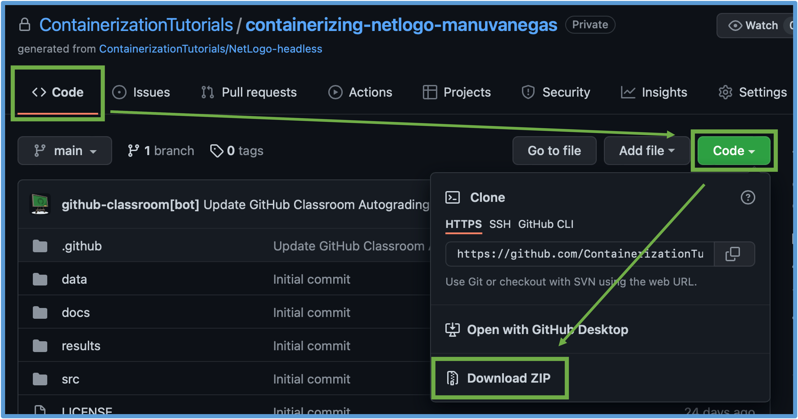

# Containerizing your own model


### Setting up your containerization folder

 1. Make sure you have [Docker Desktop](https://www.docker.com/products/docker-desktop) or another [Docker Engine](https://docs.docker.com/engine/install/) installed.

 2. Download this repository to your machine. To do this, scroll to the top of this page, right-click on the `< > Code` tab and select "Open Link in New Tab". In the tab you just opened, just above the box showing all the contents of this repository, you will see a green `Code` button. Click on it and then on `Downlad ZIP`. In the new window, select the location you want for the zip file and, once it has downloaded, unzip it. You will notice that the project's main folder will be `containerizing-netlogo-(your username)-main`.
 

 
 3. It is useful to have a toy BehaviorSpace experiment that does not take long to run. We suggest to create one within your NetLogo model file so you can test the containerization process. You can always delete it and replace your Docker image with the new version of the model once you know the containerization will work.
 
 4. Copy and paste your NetLogo model into `src` and delete `Wolf Sheep Predation.nlogo`. If you have any input files that your model depends on, be sure to copy them into an appropriate folder (e.g., put your input data in the `data` folder) and double-check that your code uses a _relative_ path that points to the right file location. For example, if your model uses a csv file in the `data` folder, the path you use should be `../data/thefile.csv`. It is important to use relative paths because, once containerized, the _absolute_ paths to your model and supporting data are probably going to change.
 
 5. (Optional) Consider deleting the contents of the `extras` folder and all the `README.md` files before you build your image, since they are included here just as guidance tools. Deleting these files from your local copy of this repository will not introduce changes to the version you see on GitHub's browser interface.
 
 6. If your model uses NetLogo extensions that are not bundled with the program's download, it is necessary to manually copy those files into the `src` folder. You will find these extensions in the folder where the NetLogo program itself is located (make sure you are looking under the right NetLogo version). Copy the **folder** corresponding to the extension of interest, with all of its contents, to the `src` folder.
 
 You might find useful the following description, taken from NetLogo's [Extensions Guide](https://ccl.northwestern.edu/netlogo/docs/extensions.html):

> Each NetLogo extension consists of a folder with the same name as the extension, entirely in lower case. This folder must contain a JAR file with the same name as the folder. For example, the `sound` extension is stored in a folder called `sound` with a file inside called `sound.jar`.

Here is where the `extensions` folder is located in the different operating systems, taken from the same Guide above:

> The extensions folder within your installation of NetLogo. For typical NetLogo installations:
> - On Mac OS X: /Applications/NetLogo 6.2.2/extensions
> - On 64-bit Windows with 64-bit NetLogo or 32-bit Windows with 32-bit NetLogo: C:\Program Files\NetLogo 6.2.2\app\extensions
> - On 64-bit Windows with 32-bit NetLogo: C:\Program Files (x86)\NetLogo 6.2.2\app\extensions
> - On Linux: the app/extensions subdirectory of the NetLogo directory extracted from the installation .tgz
 
### Following the three steps: `Dockerfile`, `docker build`, `docker run`.

 [This video section](https://youtu.be/ICYM-vXx_Q4?t=132) provides a visual guidance for steps 7 to 10.
    
 7. Open a terminal window and navigate to the folder containing the downloaded repository. Here are some useful guides to do so in [Mac](https://www.macworld.com/article/2042378/master-the-command-line-navigating-files-and-folders.html) and [Windows](https://www.computerhope.com/issues/chusedos.htm). Note that it is important to complete the next steps from the folder where this repository was downloaded. For example, if you downloaded it into `~/Documents/containerizing-netlogo-(yourusername)-main`, then you should navigate to that point. To make sure you are in the right place, you can type `pwd` (or `cd` in Windows) and the terminal will print the absolute path of the folder you are currently in. You can also type `ls` (or `dir` in Windows) and you should see, among other files and folders, the `Dockerfile` you created when completing the tutorial.
 
 8. Copy the `build` command from Step 2 of the tutorial (or from `build_image.sh`) and paste it in the terminal window. Modify the appropriate arguments (`<pathtoNLfile>`, `<NLversion>`, and `<imagename>`) and run the command. This step may take a couple of minutes because a new copy of the NetLogo version you specified has to be downloaded. If you get errors, you can visit the [Troubleshooting](../extras/Troubleshooting.md) guide to see common error messages and their causes.
 
 9. Once the image has been built, copy the `run` command from Step 3 (or from `run_experiment.sh`) and modify the appropriate sections (`<path/to/your/results/folder>`, `<imagename>`, and `<experimentname>`). Remember to use the _absolute_ path for the folder where results will be stored in. If, following the previous example, you downloaded the repository into `~/Documents/containerizing-netlogo-(yourusername)-main`, then you can use the path `~/Documents/Containerizing-netlogo-(yourusername)-main/results`. If you are not sure of the path you should use, you can type `pwd` (or `cd` in Windows) and just add `/results` to the path shown (assuming you are still in the project's folder).
 
 10. At the end of the run, you should see the files `table-output.csv` and `spreadsheet-output.csv` in the folder you indicated in the last step (if you followed our suggestion, that would be `results`). If you want to have only one output format, you can delete either the last or the second-to-last line of your Dockerfile, respectively. For example, if you only want to get `table-output.csv`, the last three lines of your code should look like the following:
 
```Dockerfile
ENTRYPOINT ["/home/netlogo/netlogo-headless.sh", \
"--model", "/home/src/NLModel.nlogo", \
"--table", "/home/results/table-output.csv"]
``` 
 
Note that we deleted the `, /` symbols that were originally at the end of the last line and replaced them with a closing bracket. To see the changes, you will need to repeat the steps 7 to 9. In case you see like everything seems to work, but you don't see a difference in the output files, remember that repeating these steps using the modified Dockerfile will not delete the output format you are not interested on; it will only rewrite the output file you decided to keep.
 
### Finalizing
 
 11. Great! You have successfully containerized your model. There is no need to push your changes back to GitHub! Doing so will cause the tests for the three steps to fail again. Note that if you edit your model (say, you fix a bug you didn't see before or delete the dummy BehaviorSpace you created to test the containerization process), these changes will not be reflected in the model you containerized. You will need to repeat steps 7 to 9 to containerize the new version of the model. Don't worry: Docker should be able to use the NetLogo it downloaded previously to create the new image version, so you won't need to wait for too long.
 
 
